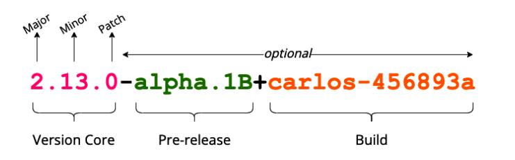
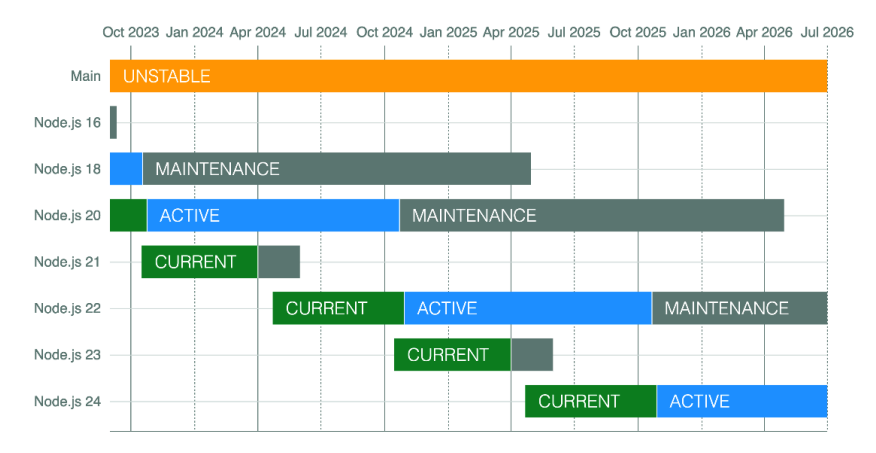

# Chapter 1

## What makes Node.js so special and why it is a revolutionary technology

Node it is a lightweight and fast technology, based on V8 JavaScript engine. Node can run in different
platforms in any operating system and architecture, it is easy to learn the learning curve is very small
you can develop while you learn easily, he has a huge ecosystem and the community is very engaged.

## The Node.js architecture and how it works

Node use a different approach(Non-blocking I/O), it doesn't split the resources keep they in a single-thread
and use a non-blocking I/O and this allows to free resource while is waiting this is totally different 
from other languages and with this we have less memory consumption.

## How to identify the right Node.js version for your projects

Node.js follows semantic versioning.

When a new version is released, the version number is incremented following the SemVer rules:
• Major versions add incompatible API changes
• Minor versions add functionality in a backward-compatible manner
• Patch versions add backward-compatible bug fixes

In Node.js, releases have three different phases:
• Current is the phase where new features (non-major changes) are added to the project. This
phase is very active, and it is not always recommended to use it in production as it is not a
stable version.
• Active Long-Term Support (LTS) is the phase where the version is stable and has been updated
by the LTS team. This phase still includes new features, bug fixes, and updates. This phase is
stable, so it is recommended to use it in production.
• Maintenance is the phase where the version is not receiving any new features, only critical bug
fixes and security updates. This phase is recommended for projects that are not able to upgrade
yet to the latest active LTS version.

For any new project it is recommend use the LTS version.